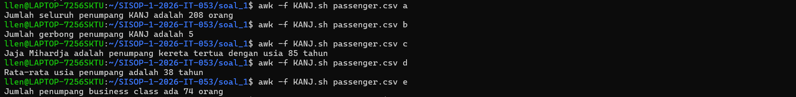
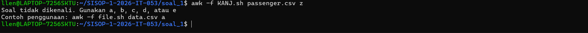

# SISOP-1-2026-IT-053

## Reporting

### Soal 1

***ARGO NGAWI JESGEJES***

Langkah pertama, mendownlaod file `passenger.csv` menggunakan perintah `wget`

```bash
wget -O passenger.csv "https://docs.google.com/spreadsheets/d/1NHmyS6wRO7To7ta-NLOOLHkPS6valvNaX7tawsv1zfE/export?format=csv"
```

Selanjutnya membuat `shell scripting` dengan nama `KANJ.sh` yang memuat semua kode dan logika yang akan dijadikan file input untuk command `awk` untuk menyelesaikan subsoal a-e

Pertama, untuk subsoal a, menghitung setiap baris yang ada pada `passenger.csv` kecuali baris pertama dengan menambahkan variabel `penumpang` di setiap baris `NR>1`

```bash
soal == "a" && NR>1 {
	penumpang++
}
```

Untuk subsoal b, menghitung berapa banyak gerbong unik yang ada di `passenger.csv`. Untuk menghitungnya, membuat sebuah array `gerbong` dengan anggotanya kolom gerbong, yaitu kolom `$4`

```bash
soal == "b" && NR>1 {
	gerbong[$4]
}
```

Untuk subsoal c, mencari penumpang tertua dengan cara membuat variabel `max` dan membandingkannya dengan setiap umur yang ada di kolom umur (kolom `$2`) dan menggantinya setiap terdapat umur yang lebih besar serta menset namanya ke variabel `oldest`

```bash
soal == "c" && NR>1 {
	if($2>max){
		max=$2
		oldest=$1
	}
}
```

Untuk subsoal d, membuat variabel `total_umur` yang menghitung jumlah semua umur penumpang pada `passenger.csv` serta menghitung jumlah penumpangnya dengan variabel `penumpang`. Di akhir, membuat variabel `average` yang merupakan hasil pembagian dari `total_umur/penumpang`

```bash
soal == "d" && NR>1 {
	total_umur+=$2
	penumpang++
	average=int((total_umur/penumpang)+0.5)
}
```

Untuk subsoal e, menghitung jumlah penumpang business dengan membuat variabel `business` dan menambahkan nilainya jika kolom jenis gerbong pada data adalah "Business" (kolom `$3`)

```bash
soal == "e" && NR>1 {
	if($3=="Business"){
		business++
	}
}
```

Menyatukan semua logika dan membuat setiap print nya berbeda berdasarkan argumen yang diinput oleh User pada file `KANJ.sh`

```bash
BEGIN {
	soal = ARGV[2]
	delete ARGV[2]
	FS=","
}

soal == "a" && NR>1 {
	penumpang++
}

soal == "b" && NR>1 {
	gerbong[$4]
}

soal == "c" && NR>1 {
	if($2>max){
		max=$2
		oldest=$1
	}
}

soal == "d" && NR>1 {
	total_umur+=$2
	penumpang++
	average=int((total_umur/penumpang)+0.5)
}

soal == "e" && NR>1 {
	if($3=="Business"){
		business++
	}
}

END {
	if(soal == "a"){
		print "Jumlah seluruh penumpang KANJ adalah", penumpang, "orang"
	}
	else if(soal == "b"){
		print "Jumlah gerbong penumpang KANJ adalah", length(gerbong)
	}
	else if(soal == "c"){
		print oldest, "adalah penumpang kereta tertua dengan usia", max, "tahun"
	}
	else if(soal == "d"){
		print "Rata-rata usia penumpang adalah", average, "tahun"
	}
	else if(soal == "e"){
		print "Jumlah penumpang business class ada", business, "orang"
	}
	else{
		print "Soal tidak dikenali. Gunakan a, b, c, d, atau e"
		print "Contoh penggunaan: awk -f file.sh data.csv a"
	}
}
```

Pada shellscript tersebut, merupakan implementasi penggunaan input perintah pada file untuk `awk -f` sehingga User dapat menginput command sebagai berikut:

```bash
awk -f KANJ.sh passenger.csv [subsoal]
```

dimana `KANJ.sh` merupakan argumen 1, dan `[subsoal]` merupakan argumen 2. Oleh karena itu pada shellscript dibuat variabel `soal` yang menerima nilai yang sama dengan argumen 2 (`[subsoal]`) dan menghapus argumen 2 agar tidak dikira merupakan input file. Dan terakhir menambahkan output `Soal tidak dikenali. Gunakan a, b, c, d, atau e` apabila input argumen user tidak sesuai.

#### Output

Berikut hasil command `awk -f KANJ.sh passenger.csv [subsoal]` yang dijalankan pada setiap subsoal:


Berikut apabila user menginput dengan argumen subsoal yang tidak sesuai:


#### Kendala

Tidak ada kendala

### Soal 2

***EKSPEDISI PESUGIHAN GUNUNG KAWI - MAS AMBA***

Pada soal ini diberi langkah pertama untuk mendownload file peta-ekspedisi-amba.pdf dan menyimpannya ke folder ekspedisi dengan perintah gdown. Diarahkan bahwa membutuhkan tambahan Pip dan Virtual Environment.

Karena pada device praktikan sudah terdapat Pip, maka langkah selanjutnya adalah membaut virtual environment pada `home/` dan mengaktifkannya

```bash
python3 -m venv myenv
source myenv/bin/activate
```

Setelah diaktifkan, install gdown dengan pip dan pindah ke folder `ekspedisi/` untuk mendownload file dari link yang disediakan

```bash
pip install gdown
cd SISOP-1-2026-IT-053/soal_2/ekspedisi
gdown https://drive.google.com/uc?id=1q10pHSC3KFfvEiCN3V6PTroPR7YGHF6Q
```

Setelah selesai download, menonaktifkan virtual environment dengan `deactivate`

```bash
deactivate
```

Langkah selanjutnya adalah membaca file tersebut dengan menggunakan `concatonate`

```bash
cat peta-ekspedisi-amba.pdf
```

Setelah file yang begitu panjang selesai di baca, terdapat string di bagian akhir output tersebut yang memberikan informasi tentang sebuah link:

```text
0001156836 00000 n
0001158191 00000 n
0001159551 00000 n
trailer
<<
/Root 1 0 R
/Info 3 0 R
/ID [<2C4C9BC9143DED2EFA3784512A34BC34> <2C4C9BC9143DED2EFA3784512A34BC34>]
/Size 41
>>
startxref
1160568
%%EOF
https://github.com/pocongcyber77/peta-gunung-kawi.git
```

Link ini mereferensi ke sebuah repository github, langkah selanjutnya adalah melakukan cloning terhadap repository tersebut

```bash
git clone https://github.com/pocongcyber77/peta-gunung-kawi.git
```

Pada repo `peta-gunung-kawi` tersebut, terdapat sebuah file gsxtrack.json. Setelah dicek menggunakan `cat` terdapat beberapa baris teks yang berisi titik-titik koordinat dari total 4 koordinat situs.

```bash
cd peta-gunung-kawi
cat gsxtrack.json
```

```text
{
"type": "FeatureCollection",
"name": "gunung_kawi_spatial_nodes",
"dataset_info": {
"crs": "EPSG:4326",
"datum": "WGS84",
"region": "Gunung Kawi, East Java, Indonesia",
"edge_distance_m": 2000,
"generated_at": "2026-03-13T10:02:00Z"
},
"features": [
{
"type": "Feature",
"id": "node_001",
"properties": {
"site_name": "Titik Berak Paman Mas Mba",
"node_class": "primary_reference_point",
"latitude": -7.920000,
"longitude": 112.450000,
"elevation_m": 254,
"status": "active"
},
"geometry": {
"type": "Point",
"coordinates": [112.450000, -7.920000]
}
},
{
"type": "Feature",
"id": "node_002",
"properties": {
"site_name": "Basecamp Mas Fuad",
"node_class": "field_operations_base",
"latitude": -7.920000,
"longitude": 112.468100,
"elevation_m": 261,
"status": "active"
},
"geometry": {
"type": "Point",
"coordinates": [112.468100, -7.920000]
}
},
{
"type": "Feature",
"id": "node_003",
"properties": {
"site_name": "Gerbang Dimensi Keputih",
"node_class": "anomaly_site",
"latitude": -7.937960,
"longitude": 112.468100,
"elevation_m": 248,
"status": "restricted"
},
"geometry": {
"type": "Point",
"coordinates": [112.468100, -7.937960]
}
},
{
"type": "Feature",
"id": "node_004",
"properties": {
"site_name": "Tembok Ratapan Keputih",
"node_class": "boundary_marker",
"latitude": -7.937960,
"longitude": 112.450000,
"elevation_m": 246,
"status": "inactive"
},
"geometry": {
"type": "Point",
"coordinates": [112.450000, -7.937960]
}
}
]
}
```

Pada setiap situs, memiliki `id`, `site_name`, `latitude`, dan `longitude`. Selanjutnya membuat shellscript `parserkoordinat.sh` untuk merapikan informasi tersebut ke file `titikpenting.txt`
