# SISOP-1-2026-IT-053

## Reporting

### Soal 1

***ARGO NGAWI JESGEJES***

Langkah pertama, mendownlaod file `passenger.csv` menggunakan perintah `wget`

```bash
wget -O passenger.csv "https://docs.google.com/spreadsheets/d/1NHmyS6wRO7To7ta-NLOOLHkPS6valvNaX7tawsv1zfE/export?format=csv"
```

Selanjutnya membuat `shell scripting` dengan nama `KANJ.sh` yang memuat semua kode dan logika yang akan dijadikan file input untuk command `awk` untuk menyelesaikan subsoal a-e

Pertama, untuk subsoal a, menghitung setiap baris yang ada pada `passenger.csv` kecuali baris pertama dengan menambahkan variabel `penumpang` di setiap baris `NR>1`

```bash
soal == "a" && NR>1 {
	penumpang++
}
```

Untuk subsoal b, menghitung berapa banyak gerbong unik yang ada di `passenger.csv`. Untuk menghitungnya, membuat sebuah array `gerbong` dengan anggotanya kolom gerbong, yaitu kolom `$4`. Sebelum dimasukkan ke dalam array, membersihkan `/r` agar Gerbong di baris terakhir tidak terhitung berbeda dengan Gerbong dengan nama unik yang sama di baris lainnya.

```bash
soal == "b" && NR>1{
    g=$4
    sub(/\r$/,"",g)
    g=gensub(/^ +| +$/,"","g",g)
    gerbong[g]
}
```

	REVISI: Memperbaiki script yang sebelumnya hanya mencari nama unik gerbong menjadi mengubah semua nama unik gerbong menjadi format yang sama (tanpa /r [return]), lalu memasukkannya ke dalam Array. Hal ini sebagai pencegahan apabila gerbong unik di baris terakhir yang tidak mengandung '/r' bisa tetap terhitung.

Untuk subsoal c, mencari penumpang tertua dengan cara membuat variabel `max` dan membandingkannya dengan setiap umur yang ada di kolom umur (kolom `$2`) dan menggantinya setiap terdapat umur yang lebih besar serta menset namanya ke variabel `oldest`

```bash
soal == "c" && NR>1 {
	if($2>max){
		max=$2
		oldest=$1
	}
}
```

Untuk subsoal d, membuat variabel `total_umur` yang menghitung jumlah semua umur penumpang pada `passenger.csv` serta menghitung jumlah penumpangnya dengan variabel `penumpang`. Di akhir, membuat variabel `average` yang merupakan hasil pembagian dari `total_umur/penumpang`

```bash
soal == "d" && NR>1 {
	total_umur+=$2
	penumpang++
	average=int((total_umur/penumpang))
}
```

	REVISI: Menghilangkan +0.5 di perhitungan average karena soal tidak meminta untuk dibulatkan ke bilangan bulat terdekat, jadi cukup dibulatkan ke bawah saja

Untuk subsoal e, menghitung jumlah penumpang business dengan membuat variabel `business` dan menambahkan nilainya jika kolom jenis gerbong pada data adalah "Business" (kolom `$3`)

```bash
soal == "e" && NR>1 {
	if($3=="Business"){
		business++
	}
}
```

Menyatukan semua logika dan membuat setiap print nya berbeda berdasarkan argumen yang diinput oleh User pada file `KANJ.sh`

```bash
BEGIN {
	soal = ARGV[2]
	delete ARGV[2]
	FS=","
}

soal == "a" && NR>1 {
	penumpang++
}

soal == "b" && NR>1 {
	gerbong[$4]
}

soal == "c" && NR>1 {
	if($2>max){
		max=$2
		oldest=$1
	}
}

soal == "d" && NR>1 {
	total_umur+=$2
	penumpang++
	average=int((total_umur/penumpang)+0.5)
}

soal == "e" && NR>1 {
	if($3=="Business"){
		business++
	}
}

END {
	if(soal == "a"){
		print "Jumlah seluruh penumpang KANJ adalah", penumpang, "orang"
	}
	else if(soal == "b"){
		print "Jumlah gerbong penumpang KANJ adalah", length(gerbong)
	}
	else if(soal == "c"){
		print oldest, "adalah penumpang kereta tertua dengan usia", max, "tahun"
	}
	else if(soal == "d"){
		print "Rata-rata usia penumpang adalah", average, "tahun"
	}
	else if(soal == "e"){
		print "Jumlah penumpang business class ada", business, "orang"
	}
	else{
		print "Soal tidak dikenali. Gunakan a, b, c, d, atau e"
		print "Contoh penggunaan: awk -f file.sh data.csv a"
	}
}
```

Pada shellscript tersebut, merupakan implementasi penggunaan input perintah pada file untuk `awk -f` sehingga User dapat menginput command sebagai berikut:

```bash
awk -f KANJ.sh passenger.csv [subsoal]
```

dimana `KANJ.sh` merupakan argumen 1, dan `[subsoal]` merupakan argumen 2. Oleh karena itu pada shellscript dibuat variabel `soal` yang menerima nilai yang sama dengan argumen 2 (`[subsoal]`) dan menghapus argumen 2 agar tidak dikira merupakan input file. Dan terakhir menambahkan output `Soal tidak dikenali. Gunakan a, b, c, d, atau e` apabila input argumen user tidak sesuai.

#### Output

1.1 Hasil command `awk -f KANJ.sh passenger.csv [subsoal]` yang dijalankan pada setiap subsoal:


1.2 Output apabila user menginput dengan argumen subsoal yang tidak sesuai:


#### Kendala

Tidak ada kendala

### Soal 2

***EKSPEDISI PESUGIHAN GUNUNG KAWI - MAS AMBA***

Pada soal ini diberi langkah pertama untuk mendownload file peta-ekspedisi-amba.pdf dan menyimpannya ke folder ekspedisi dengan perintah gdown. Diarahkan bahwa membutuhkan tambahan Pip dan Virtual Environment.

Karena pada device praktikan sudah terdapat Pip, maka langkah selanjutnya adalah membaut virtual environment pada `home/` dan mengaktifkannya

```bash
python3 -m venv myenv
source myenv/bin/activate
```

Setelah diaktifkan, install gdown dengan pip dan pindah ke folder `ekspedisi/` untuk mendownload file dari link yang disediakan

```bash
pip install gdown
cd SISOP-1-2026-IT-053/soal_2/ekspedisi
gdown https://drive.google.com/uc?id=1q10pHSC3KFfvEiCN3V6PTroPR7YGHF6Q
```

Setelah selesai download, menonaktifkan virtual environment dengan `deactivate`

```bash
deactivate
```

Langkah selanjutnya adalah membaca file tersebut dengan menggunakan `concatonate`

```bash
cat peta-ekspedisi-amba.pdf
```

Setelah file yang begitu panjang selesai di baca, terdapat string di bagian akhir output tersebut yang memberikan informasi tentang sebuah link:

```text
...
0001156836 00000 n
0001158191 00000 n
0001159551 00000 n
trailer
<<
/Root 1 0 R
/Info 3 0 R
/ID [<2C4C9BC9143DED2EFA3784512A34BC34> <2C4C9BC9143DED2EFA3784512A34BC34>]
/Size 41
>>
startxref
1160568
%%EOF
https://github.com/pocongcyber77/peta-gunung-kawi.git
```

Link ini mereferensi ke sebuah repository github, langkah selanjutnya adalah melakukan cloning terhadap repository tersebut

```bash
git clone https://github.com/pocongcyber77/peta-gunung-kawi.git
```

Pada repo `peta-gunung-kawi` tersebut, terdapat sebuah file gsxtrack.json. Setelah dicek menggunakan `cat` terdapat beberapa baris teks yang berisi titik-titik koordinat dari total 4 koordinat situs.

```bash
cd peta-gunung-kawi
cat gsxtrack.json
```

```text
{
"type": "FeatureCollection",
"name": "gunung_kawi_spatial_nodes",
"dataset_info": {
"crs": "EPSG:4326",
"datum": "WGS84",
"region": "Gunung Kawi, East Java, Indonesia",
"edge_distance_m": 2000,
"generated_at": "2026-03-13T10:02:00Z"
},
"features": [
{
"type": "Feature",
"id": "node_001",
"properties": {
"site_name": "Titik Berak Paman Mas Mba",
"node_class": "primary_reference_point",
"latitude": -7.920000,
"longitude": 112.450000,
"elevation_m": 254,
"status": "active"
},
"geometry": {
"type": "Point",
"coordinates": [112.450000, -7.920000]
}
},
{
"type": "Feature",
"id": "node_002",
"properties": {
"site_name": "Basecamp Mas Fuad",
"node_class": "field_operations_base",
"latitude": -7.920000,
"longitude": 112.468100,
"elevation_m": 261,
"status": "active"
},
"geometry": {
"type": "Point",
"coordinates": [112.468100, -7.920000]
}
},
{
"type": "Feature",
"id": "node_003",
"properties": {
"site_name": "Gerbang Dimensi Keputih",
"node_class": "anomaly_site",
"latitude": -7.937960,
"longitude": 112.468100,
"elevation_m": 248,
"status": "restricted"
},
"geometry": {
"type": "Point",
"coordinates": [112.468100, -7.937960]
}
},
{
"type": "Feature",
"id": "node_004",
"properties": {
"site_name": "Tembok Ratapan Keputih",
"node_class": "boundary_marker",
"latitude": -7.937960,
"longitude": 112.450000,
"elevation_m": 246,
"status": "inactive"
},
"geometry": {
"type": "Point",
"coordinates": [112.450000, -7.937960]
}
}
]
}
```

Pada setiap situs, memiliki `id`, `site_name`, `latitude`, dan `longitude`. Selanjutnya membuat shellscript `parserkoordinat.sh` untuk merapikan informasi tersebut ke file `titik-penting.txt`

```bash
#!/bin/bash

input="gsxtrack.json"
output="titik-penting.txt"

awk '
BEGIN {
    FS=":"
    id_i=0
    site_i=0
    lat_i=0
    lon_i=0
}

/"id"/ {
    gsub(/[",]/,"",$2)		# ganti koma & petik jadi kosong
    id[id_i++] = trim($2)	# masukin ke array + bikin fungsi buat ngilangin spasi sama tab
}

/"site_name"/ {
    gsub(/[",]/,"",$2)
    site[site_i++] = trim($2)
}

/"latitude"/ {
    gsub(/[",]/,"",$2)
    lat[lat_i++] = trim($2)
}

/"longitude"/ {
    gsub(/[",]/,"",$2)
    long[lon_i++] = trim($2)
}

function trim(x) {		#fungsi ngilangin spasi sama tab
    sub(/^[ \t]+/, "", x)
    sub(/[ \t]+$/, "", x)
    return x
}

END {
    out = "'"$output"'"
    for (i = 0; i < site_i; i++) {
        print id[i] "," site[i] "," lat[i] "," long[i] > out
    }
}
' "$input"

echo "Titik ditemukan, cek di $output"
```

Jika dilihat pada file json, terlihat bahwa setiap jenis dan detailnya dipisahkan oleh `:`, oleh karena itu dengan menggunakan Field Separator `FS=":"` kita dapat memisahkan kolom jenis dan detail.

`/"jenis"/` digunakan untuk memfilter perbaris json dengan menggunakan `awk` untuk mencari baris yang berisi jenis yang dicari (`id, site_name, latitude, longitude`) karena setiap kolom jenis pasti diapit `""`.

Setelah mendapatkan baris yang terfilter, mengganti tanda `,` dan `"` pada kolom detail (`$2`) menjadi kosong `""`, serta menghilangkan adanya spasi dan tab menggunakan fungsi buatan `trim` lalu memasukkannya ke dalam array masing-masing.

Di akhir, print semua array tadi per baris dengan format `id,site_name,latitude,longitude` dan diletakkan pada file `titik-penting.txt`. Didapatkan:

```text
node_001,Titik Berak Paman Mas Mba,-7.920000,112.450000
node_002,Basecamp Mas Fuad,-7.920000,112.468100
node_003,Gerbang Dimensi Keputih,-7.937960,112.468100
node_004,Tembok Ratapan Keputih,-7.937960,112.450000
```

Setelah mendapatkan 4 titik penting yang berbentuk persegi tersebut, mencari `koordinat pusaka` dengan cara mencari titik tengah dari dua koordinat yang berseberangan menggunakan shellscript `nemupusaka.sh`.

```bash
#!/bin/bash

input="titik-penting.txt"
output="posisipusaka.txt"
first_lat=""
first_long=""

awk '
BEGIN {
    FS=","
}

first_lat=="" && first_long=="" {
    first_lat = $3
    first_long = $4
}

first_lat!=$3 && first_long!=$4 {
    second_lat = $3
    second_long = $4
}

END {
    out = "'"$output"'"
    print "Koordinat pusat:" > out
    print (first_lat+second_lat)/2 "," (first_long+second_long)/2 > out
}' "$input"

cat "$output"
```

Dengan menggunakan `awk`, memisahkan antarkolom dan mencari 2 koordinat yang berseberangan dengan `latitude` dan `longitude` yang berbeda. Di akhir, mencetak koordinat tengah dari kedua koordinat tersebut ke dalam file `posisipusaka.txt`. Didapatkan:

```text
Koordinat pusat:
-7.92898,112.459
```

#### Output

2.1 Membuat `venv` untuk mendownload file dengan menggunakan `gdown`

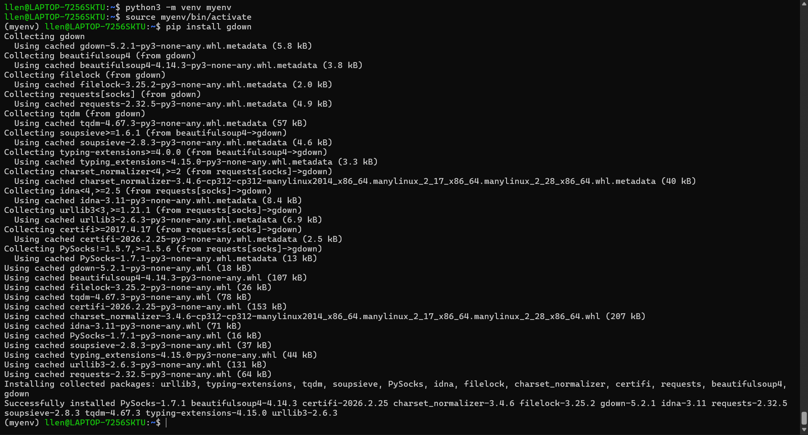
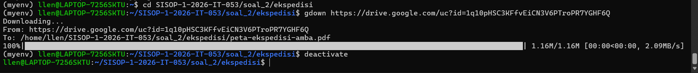

2.2 Mengeksekusi script `parserkoordinat.sh` untuk mencari koordinat penting

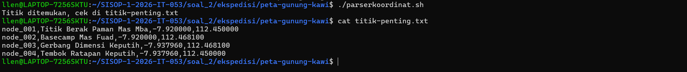

2.3 Mengeksekusi script `nemupusaka.sh` untuk mencari koordinat pusaka

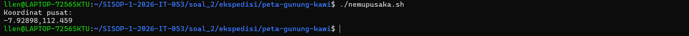

#### Kendala

Tidak ada kendala

### Soal 3

***KOS SLEBEW AMBATUKAM***

Pada soal ini diarahkan untuk membuat sebuah sistem manajemen kost berbasis CLI dengan menu interaktif. Script ini diberi nama `kost_slebew.sh` dan dapat dijalankan melalui terminal. Langkah pertama yang saya lakukan adalah membuat interface menu sistem tersebut.

```bash
menu() {
    while true; do
        echo ""
        echo " _  __          _     _____ _      _			"
        echo "| |/ /___  ___ | |_  / ____| |    | |			"
        echo "| ' // _ \/ __|| __| | (___| | ___| |__  _____      __	"
        echo "| . \ (_) \__ \| |_   \___ \ |/ _ \ '_ \/ _ \ \ /\ / /	"
        echo "|_|\_\___/|___/ \__|  ____)  |  __/ |_) | __/\ V  V /	"
        echo "                     |_____/_|\___|_.__/\___| \_/\_/	"
        echo ""
        echo "=========================================================="
        echo "               SISTEM MANAJEMEN KOST SLEBEW		"
        echo "=========================================================="
        echo " ID | OPTION						"
        echo "----------------------------------------------------------"
        echo "  1 | Tambah Penghuni Baru				"
        echo "  2 | Hapus Penghuni					"
	echo "  3 | Tampilkan Daftar Penghuni				"
	echo "  4 | Update Status Penghuni				"
	echo "  5 | Cetak Laporan Keuangan				"
	echo "  6 | Kelola Cron (Pengingat Tagihan)			"
	echo "  7 | Exit Program					"
	echo "=========================================================="
	read -p "Enter option [1-7]: " option

	case $option in
	    1) tambah_penghuni ;;
	    2) hapus_penghuni ;;
	    3) daftar_penghuni ;;
	    4) update_status ;;
	    5) laporan_keuangan ;;
	    6) kelola_cron ;;
	    7) echo ""; echo "Slebewww... keluar dari program..."; break;;
	    *) echo "Pilihan invalid." ;;
	esac
    done
}
```

Langkah selanjutnya adalah membuat format folder dan file penting yang akan digunakan sebagai hasil output nanti, yaitu `DATA_FILE: penghuni.csv`, `ERASE_HISTORY: history_hapus.csv`, `FINAN_REPORT: laporan_bulanan.txt`, dan `INVOICE_LOG: tagihan.log`.

```bash
DATA_FILE="$(dirname "$0")/data/penghuni.csv"
ERASE_HISTORY="$(dirname "$0")/sampah/history_hapus.csv"
FINAN_REPORT="$(dirname "$0")/rekap/laporan_bulanan.txt"
INVOICE_LOG="$(dirname "$0")/log/tagihan.log"

mkdir -p "$(dirname "$DATA_FILE")"
mkdir -p "$(dirname "$ERASE_HISTORY")"
mkdir -p "$(dirname "$FINAN_REPORT")"
mkdir -p "$(dirname "$INVOICE_LOG")"

if [ ! -f "$DATA_FILE" ]; then
    touch "$DATA_FILE"
fi
if [ ! -s "$DATA_FILE" ]; then
    echo "Nama,Kamar,Harga Sewa,Tanggal Masuk,Status Awal" >  "$DATA_FILE"
fi

if [ ! -f "$ERASE_HISTORY" ]; then
    touch "$ERASE_HISTORY"
fi
if [ ! -s "$ERASE_HISTORY" ]; then
    echo "Nama,Kamar,Harga Sewa,Tanggal Masuk,Status Awal,Tanggal Hapus" >  "$ERASE_HISTORY"
fi

touch "$FINAN_REPORT"
touch "$INVOICE_LOG"
```

Script tersebut berfungsi sebagai global variabel untuk memudahkan akses ke data yang ada, dan juga sebagai inisialisasi awal dan langkah untuk memastikan agar folder-folder dan file-file tersebut benar-benar sudah ada dan dibuat.

Langkah selanjutnya membuat setiap fungsi dari menu tersebut. Fungsi pertama adalah `tambah_penghuni`

```bash
tambah_penghuni() {
    echo ""
    echo "======================================================"
    echo "		    TAMBAH PENGHUNI			"
    echo "======================================================"
    read -p "Masukkan Nama: " nama

    read -p "Masukkan Kamar: " kamar

    read -p "Masukkan Harga Sewa: " hargaSewa

    read -p "Masukkan Tanggal Masuk (YYYY-MM-DD): " tanggalMasuk
    if [[ ! "$tanggalMasuk" =~ ^[0-9]{4}-[0-9]{2}-[0-9]{2}$ ]]; then
	echo "Input tanggal harus sesuai format: YYYY-MM-DD !"
	return
    fi
    today=$(date +%Y-%m-%d)
    if [[ "$tanggalMasuk" > "$today" ]]; then
	echo "Tanggal masuk tidak boleh melebihi hari ini!"
	return
    fi

    read -p "Masukkan Status Awal (Aktif/Menunggak): " statusAwal

    if awk -F',' -v k="$kamar" 'NR>1 && $2==k {exit 1}' "$DATA_FILE"; then
	echo "$nama,$kamar,$hargaSewa,$tanggalMasuk,$statusAwal" >> $DATA_FILE
    	echo ""
    	echo "Penghuni \"$nama\" berhasil ditambahkan ke Kamar $kamar dengan status $statusAwal"
	echo ""
	read -p "Tekan [ENTER] untuk kembali ke menu..."
    else
	echo "Kamar $kamar sudah ada penghuninya"
	return
    fi
}
```

Pada fungsi tersebut, terdapat beberapa case yang harus dipatuhi, yaitu bahwa `tanggal` yang dimasukkan tidak boleh melebihi tanggal hari ini dan harus berupa format `YYYY-MM-DD`. Untuk mengatasi hal tersebut, digunakan logic `if` untuk memeriksa apakah pola `regex` pada input tanggal sama dengan apa yang diarahkan. Untuk memastikan tanggal tidak dari masa depan, membuat variabel `today` dan mengambil nilai tanggal hari ini dengan menggunakan format `YYYY-MM-DD` dan membandingkan nilainya dengan input. Selain itu diarahkan juga agar kamar yang diisi harus kamar yang masih kosong, dengan menggunakan `awk`, dapat mengecek apakah kamar yang didaftarkan masih kosong atau sudah memiliki penghuni dengan cara mengecek nilai `kamar` pada data penghuni saat ini. Jika semua sudah dirasa aman, akan menulis data penghuni baru pada baris baru dengan format `nama,kamar,harga sewa,tanggal masuk,status awal` ke dalam `data/penghuni.csv`.

Fungsi selanjutnya adalah `hapus_penghuni` berdasarkan nama dan memasukkannya ke `sampah/history_hapus.csv`

```bash
hapus_penghuni() {
    echo ""
    echo "======================================================"
    echo "		     HAPUS PENGHUNI			"
    echo "======================================================"
    read -p "Masukkan nama penghuni yang ingin dihapus: " nama

    data=$(awk -F',' -v n="$nama" 'NR>1 && tolower($1)==tolower(n) {print $0}' "$DATA_FILE")

    if [ -z "$data" ]; then
	echo "Penghuni dengan nama \"$nama\" tidak ditemukan"
	return
    fi

    tanggal_hapus=$(date +%Y-%m-%d)

    echo "$data,$tanggal_hapus" >> "$ERASE_HISTORY"

    awk -F',' -v n="$nama" 'NR==1 {print $0} NR>1 && tolower($1)!=tolower(n) {print $0}' "$DATA_FILE" > temp.csv
    mv temp.csv "$DATA_FILE"
    echo ""
    echo "Data penghuni \"$nama\" berhasil diarsipkan ke $ERASE_HISTORY dan dihapus dari sistem."
    echo ""
    read -p "Tekan [ENTER] untuk kembali ke menu..."
}
```

Untuk mendukung case insensitive, digunakan `tolower` untuk menyamakan besar/kecil dari input dan nama dalam data untuk melihat kesamaannya. Dengan menggunakan `awk`, akan dicari nama yang sama dengan apa yang diinput, dan mengeluarkan output barisnya ke variabel `data`. Setelah didapatkan datanya, maka data tersebut akan ditambahkan ke file `sampah/history_hapus` berikut dengan tanggal hapusnya. Terakhir untuk menghapus data dari `data/penghuni.csv`, digunakan `awk` untuk mencetak semua data selain data yang ingin dihapus ke dalam file sementara `temp.csv`. Setelah itu, mengubah nama `temp.csv` menjadi `penghuni.csv` dan membuatnya menimpa isi dari data yang lama.

fungsi ketiga adalah `daftar_penghuni` yang mencetak daftar penghuni saat ini dengan rapi layaknya tabel

```bash
daftar_penghuni() {
    echo ""
    echo "========================================================================================"
    echo "	       		        DAFTAR PENGHUNI KOST SLEBEW			          "
    echo "========================================================================================"

    awk -F',' 'NR==1 {
	printf "%-4s | %-20s | %-5s | %-20s | %-13s | %-10s\n", "No", $1, $2, $3, $4, $5
	printf "%-4s-+-%-20s-+-%-5s-+-%-20s-+-%-13s-+-%-10s\n", "----", "--------------------", "-----", "--------------------", "-------------", "-----------"
	next
    }
    NR>1 {
	printf "%-4s | %-20s | %-5s | Rp%-18s | %-13s | %-10s\n", NR-1, $1, $2, $3, $4, $5
	total++
	if ($5 == "Aktif") aktif++
	if ($5 == "Menunggak") nunggak++
    }
    END {
	printf "----------------------------------------------------------------------------------------\n"
	printf " Total penghuni: %d	| Aktif: %d	| Menunggak: %d\n", total, aktif, nunggak
	printf "========================================================================================\n"
    }' "$DATA_FILE"
    echo ""
    read -p "Tekan [ENTER] untuk kembali ke menu..."
}
```

Pada fungsi ini, guna menciptakan tabel yang rapi, digunakan format `printf` yaitu `placeholder string / %s`. Dengan format tersebut, memungkinkan untuk menciptakan sebuah space kosong untuk dimasukkan isi data yang sebenarnya. Untuk print setiap daftar penghuninya, dipakai `awk` untuk mengakses setiap data yang ada, dan mencetaknya satu persatu. Di akhir menampilkan `Total Penghuni`, `Aktif`, dan `Menunggak` dengan menggunakan variabel dengan nama yang serupa.

Fungsi selanjutnya adalah `update_status` yang dapat mengubah status dari penghuni yang tadinya `Aktif` ke `Menunggak` maupun sebaliknya.

```bash
update_status() {
    echo ""
    echo "======================================================"
    echo "		     UPDATE STATUS			"
    echo "======================================================"
    read -p "Masukkan Nama Penghuni: " nama
    read -p "Masukkan Status Baru (Aktif/Menunggak): " statusBaru

    awk -F',' -v nama="$nama" -v inputStatus="$statusBaru" '
    BEGIN {OFS=","}
    NR==1 {print; next}
    {
	lower = tolower(inputStatus)
	newStatus = toupper(substr(lower,1,1)) substr(lower,2)

	if (tolower($1) == tolower(nama)) {
	    $5 = newStatus
	    print $0
	    updated = 1
	} else {
	    print $0
	}
    }
    END {
	if (updated){
	    exit 0
	} else {
	    exit 1
	}
    }' "$DATA_FILE" > temp.csv

    if [ $? -eq 0 ]; then
	mv temp.csv "$DATA_FILE"
	echo "Status $nama berhasil diubah menjadi: $statusBaru"
    else
	rm temp.csv
	echo "Penghuni dengan nama \"$nama\" tidak ditemukan."
    fi

    read -p "Tekan [ENTER] untuk kembali ke menu..."
}
```

Untuk melakukan pembaruan status, langkah pertama adalah mencari data penghuni yang ingin dirubah statusnya sekaligus melakukan `print` semua data yang tidak diubah dan diubah ke dalam file sementara `temp.csv` dengan menggunakan `awk`. Jika ditemukan nama pada daftar, akan mengembalikan kode `exit 0`. Jika tida, maka akan mengembalikan kode `exit 1`. Jika exit code sesuai berhasil (`$? = 0`) maka `temp.csv` akan diganti namanya untuk menimpa `penghuni.csv`. Jika eksekusi nya masuk ke `exit 1`, secara otomatis menghapus file temp.csv yang telah dibuat. Untuk mendukung case insensitive, digunakan `tolower` untuk mengubah semua huruf menjadi lowercase baru membuat huruf awalnya menjadi uppercase dengan `toupper`.

Fungsi selanjutnya adalah `laporan_keuangan` yang memperlihatkan total pemasukan dari penghuni yang `Aktif` pada bulan ini, total tunggakan dari penghuni `Menunggak`, dan juga jumlah kamar yang terisi beserta daftar penghuni yang menunggak.

```bash
laporan_keuangan(){
    awk -F',' -v totalPemasukan=0 -v totalTunggakan=0 '
    (NR>1 && $5=="Aktif") {
	totalPemasukan+=$3
	kamarTerisi++
    }
    (NR>1 && $5=="Menunggak") {
	totalTunggakan+=$3
	daftarTunggak[$1]=$1
	kamarTerisi++
    }
    END {
	print ""
	print "======================================================"
	print "              LAPORAN KEUANGAN SLEBEW                 "
	print "======================================================"
	print " Total pemasukan (Aktif): Rp",totalPemasukan
	print " Total tunggakan	: Rp",totalTunggakan
	print " Jumlah kamar terisi	Rp:",kamarTerisi
	print "------------------------------------------------------"
	print " Daftar penghuni menunggak:"
	if (length(daftarTunggak) == 0){
	    print "  Tidak ada tunggakan.\n"
	} else {
	    for (nama in daftarTunggak) {
		print "   -", daftarTunggak[nama]
	    }
	    print "\n"
	}
    }' "$DATA_FILE" > "$FINAN_REPORT"

    cat "$FINAN_REPORT"
    echo "Laporan berhasil disimpan ke \"$FINAN_REPORT\""
    echo ""
    read -p "Tekan [ENTER] untuk kembali ke menu..."
}
```

Untuk membedakan antara penghuni yang menunggak dan aktif, digunakan `awk` untuk mengecek kolom status pada setiap baris penghuni dan memfilternya untuk menambahkan `Harga Sewa` mereka ke dalam total pemasukan/tunggakan. Sekaligus menghitung setiap baris yang dilalui oleh `awk` untuk mengetahui jumla kamar yang sedang digunakan. Untuk daftar penunggak, digunakan array `daftarTunggak` yang dapat menyimpan nama-nama penunggak di Kost Slebew. Hasil dari itu semua dicetak dalam file `rekap/laporan_bulanan.txt`

Fungsi terakhir yaitu untuk mengelola Cron Job yang dapat otomatis menyimpan daftar penunggak ke dalam sebuah file `log/tagihan.log` setiap harinya. Fungsi ini memiliki menu interaktif sendiri yang dapat digunakan untuk `membuat`, `menghapus`, dan `melihat` Cron Job yang aktif saat ini.

```bash
kelola_cron() {
    while true; do
	echo ""
	echo "=========================================================="
	echo "			  MENU CRON SLEBEW			"
	echo "=========================================================="
	echo " 1. Lihat Cron Job Aktif					"
	echo " 2. Daftarkan Cron Job Pengingat				"
	echo " 3. Hapus Cron Job Pengingat				"
	echo " 4. Kembali ke Menu Utama					"
	echo "=========================================================="
	read -p "Pilih [1-4]: " cronOption

	case $cronOption in
	    1)	echo ""
		echo "--------------Daftar Cron Job Pengingat Tagihan--------------"
		crontab -l | grep "kost_slebew.sh --check-tagihan"
		echo ""
		read -p "Tekan [ENTER] untuk kembali ke menu..."
		;;
	    2)	echo ""
		read -p "Masukkan Jam (0-23): " cronHour
		read -p "Masukkan Menit (0-59): " cronMinutes
		crontab -l | grep -v "kost_slebew.sh --check-tagihan" > newCron.tmp
		echo "$cronMinutes $cronHour * * * $(pwd)/kost_slebew.sh --check-tagihan > $(pwd)/log/tagihan.log" >> newCron.tmp
		crontab newCron.tmp
		echo ""
		echo "Jadwal reminder telah ditambahkan pada setiap hari pukul $cronHour:$cronMinutes"
		rm newCron.tmp
		echo ""
		read -p "Tekan [ENTER] untuk kembali ke menu..."
		;;
	    3)	echo ""
		crontab -l | grep -v "kost_slebew.sh --check-tagihan" > myCron.tmp
		crontab myCron.tmp
		rm myCron.tmp
		echo "Cron job pengingat tagihan berhasil dihapus."
		echo ""
		read -p "Tekan [ENTER] untuk kembali ke menu..."
		;;
	    4)	echo ""
		echo "Keluar dari Cron Job Menu..."
		break
		;;
	    *)	echo ""
		echo "Pilihan invalid."
		;;
	esac
    done
}
```

Pada menu pertama `Lihat Cron Job Aktif`, menggunakan `crontab-l` dan melakukan `grep` ke Cron Job yang dijadwalkan melakukan script `kost_slebew.sh --check-tagihan` untuk mencetak jadwal dan detail Cron Job tersebut.
Pada menu kedua `Daftarkan Cron Job Pengingat`, digunakan `crontab-l | grep -v` untuk melakukan backup semua Cron Job yang lain (Cron Job di luar manajemen kost) ke file sementara `newCron.tmp`. Lalu menambahkan Cron Job baru secara manual ke dalam file `newCron.tmp` dengan menggunakan `echo`. Lalu menjadikannya Cron Job yang baru dengan `crontab newCron.tmp`.
Pada menu ketiga `Hapus Cron Job Pengingat`, melakukan backup Cron Job lain dengan `crontab -l | grep -v` ke dalam file `myCron.tmp`. Lalu langsung menjadikannya Cron Job baru dengan `crontab myCron.tmp`, sehingga Cron Job pengingat milik sistem kost akan terhapus dari jadwal Cron Job.

Pada soal diarahkan untuk memanggil fungsi list penunggak tersebut menggunakan `--check-tagihan`. Dengan itu dibuat script yang dapat memenuhi argumen tersebut

```bash
if [[ "$1" = "--check-tagihan" ]]; then
    awk -F',' '
    NR>1 && $5=="Menunggak" {
	cmd="date +\"[%Y-%m-%d %H:%M:%S]\""
	cmd | getline timestamp
	close(cmd)
	printf "%s TAGIHAN: %s (Kamar %s) - Menunggak Rp%s\n", timestamp, $1, $2, $3
    }' "$DATA_FILE"
    exit 0
fi
```

Fungsi tersebut digunakan untuk mencetak nama-nama penunggak beserta kamar dan tagihannya ke dalam file `log/tagihan.log`.

Terakhir memanggil fungsi `menu` untuk memulai tampilan interaktif.

#### Output

3.1 Tampilan menu `kost_slebew.sh`

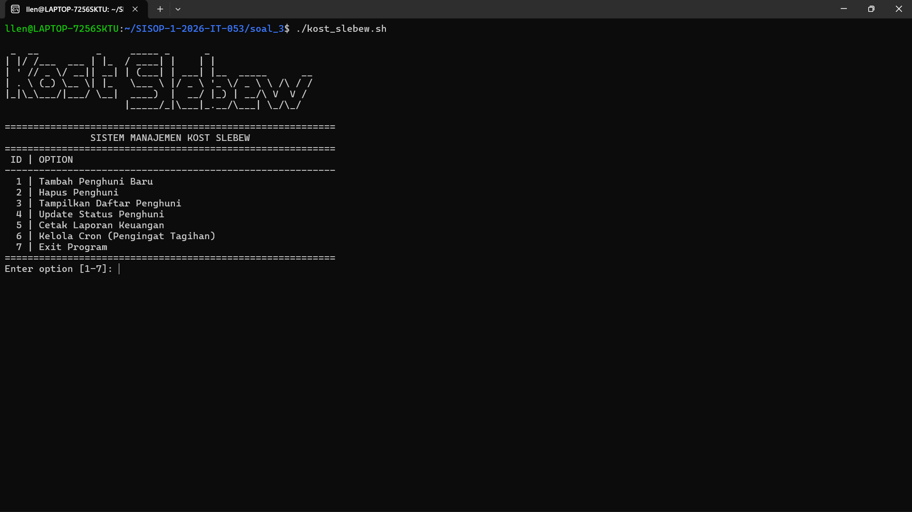

3.2 Tampilan menu `Tambah Penghuni`

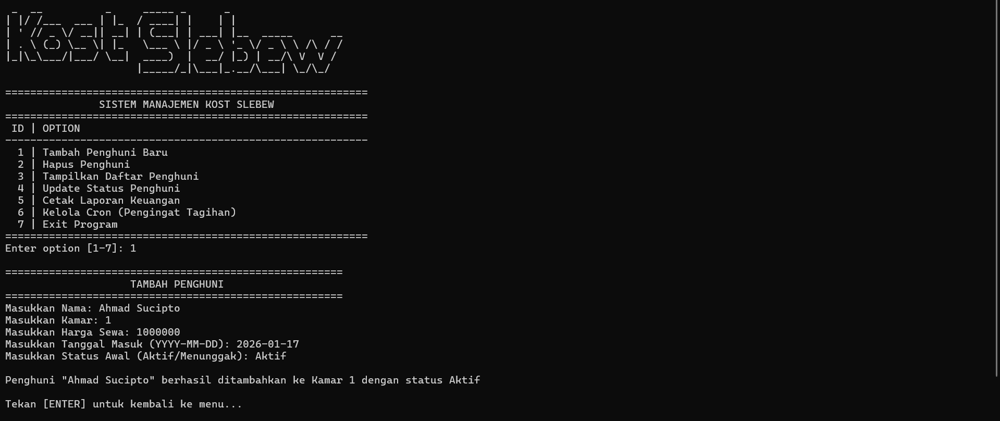

3.2.1 Tampilan kamar penuh

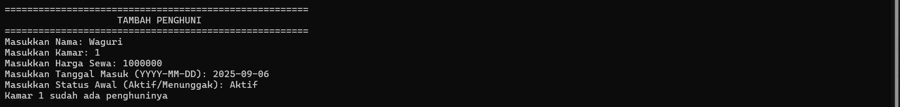

3.2.2 Tampilan format salah

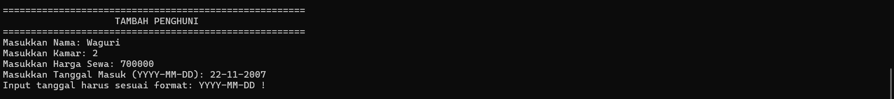

3.2.3 Tampilan tanggal lebih

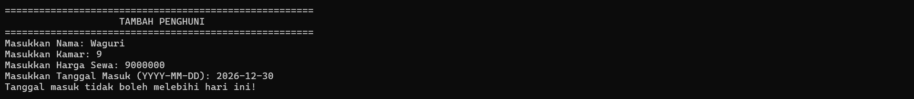

3.3 Tampilan menu `Hapus Penghuni`

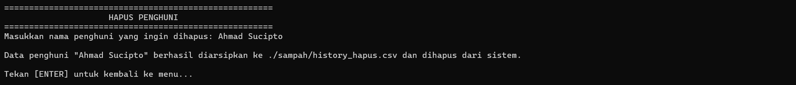

3.4 Tampilan `Daftar Penghuni`

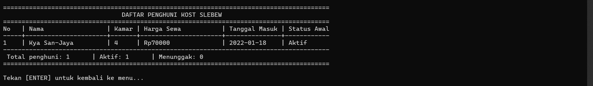

3.5 Tampilan menu `Ubah Status`

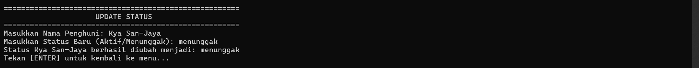

3.6 Tampilan `Laporan Bulanan`

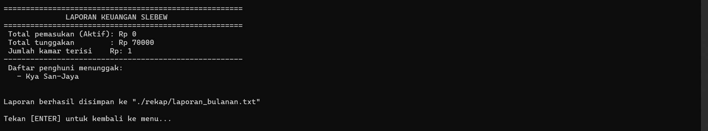

3.7 Tampilan menu `Kelola Cron`

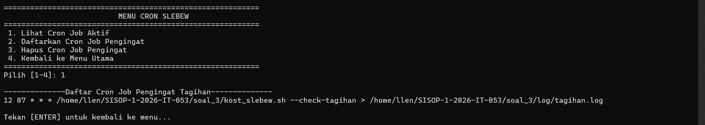


#### Kendala

Tidak ada kendala.
